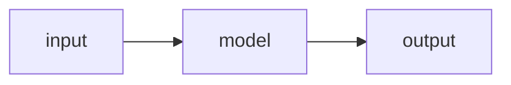

One paragraph up front: what the paper claims, what you reproduced, and the result. Someone
should be able to read only this and know how it went.

## The claim

What the paper argues, in your words, and why it is worth checking. One or two paragraphs.

## Setup

The task, the data, and the model, briefly. Then the settings side by side, so any difference
from the paper is visible:

| | Paper | Mine |
|---|---|---|
| Model | | |
| Optimizer, learning rate | | |
| Batch size | | |
| Training length | | |
| Parameters | | |

## What I built

The module layout, and the decisions that were yours rather than the paper's.

```
src/models/thing.py    what it does
src/tasks/thing.py     what it does
```

<figure>
  
  <figcaption>What the diagram shows, and what to look at in it.</figcaption>
</figure>

Diagrams can also be written inline instead of drawn:



## Results

Lead with the figure, then say what it shows.

<figure>
  
  <figcaption>Learning curve. Compare with Figure N of the paper.</figcaption>
</figure>

| Checkpoint | Mine | Paper |
|---|---|---|
| | | |

## What matched

The claims that held up, with the numbers that show it.

## What didn't

Where you diverged, each with your best explanation and how confident you are in it. This is the
most valuable section: be specific about what you cannot account for.

## What cost me time

Bugs, dead ends, and the details the paper leaves out. Write these as findings, not as a diary:
what broke, how it showed up, and what fixed it.

## Open questions

What you would test next, and what you would need to answer it.

## Running it

```sh
git clone https://github.com/mgupta8143/REPO
cd REPO
uv sync
uv run main.py train
```
