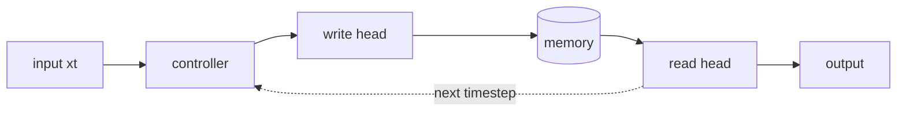

<p><em>This page is not a real reproduction. It shows the layout and section order a report uses,
so you can see the design before writing one. It is not linked from the site.</em></p>

One paragraph up front: what the paper claims, what you reproduced, and the result. Someone should
be able to read only this and know how it went. For a real example: "The paper's LSTM baseline
reaches about 0.5 bits per sequence on the copy task. Mine reaches 0.9 in the same number of
sequences, and fails to generalise past length 20 the same way theirs does."

## The claim

What the paper argues, in your words, and why it is worth checking.

## Setup

The task, the data and the model, briefly. Then every setting side by side, so any difference from
the paper is visible in one place.

| | Paper | Mine |
|---|---|---|
| Model | 3 × 256 LSTM | same |
| Optimizer | RMSProp, momentum 0.9 | same |
| Learning rate | 3e-5 | 1e-4 |
| Batch size | not stated | 16 |
| Parameters | 1,352,969 | 1,328,136 |

## What I built

The module layout, and the decisions that were yours rather than the paper's.

```
src/models/ntm/memory.py   read, write and the four addressing stages
src/models/ntm/heads.py    read and write heads
```

A diagram, either an image or written inline:



## Results

Figure first, then what it shows.

<figure>
  
  <figcaption>Figures sit in a bordered frame with a caption underneath. Replace with a plot.</figcaption>
</figure>

| Checkpoint | Mine | Paper |
|---|---|---|
| 100k sequences | 17.7 bits | ~5 bits |
| 1M sequences | 0.9 bits | ~0.5 bits |

## What matched

The claims that held up, with the numbers that show it.

## What didn't

Each divergence, with your best explanation and how confident you are in it.

## What cost me time

Bugs and omitted details, written as findings: what broke, how it showed up, what fixed it.

## Open questions

What you would test next.

## Running it

```sh
git clone https://github.com/mgupta8143/neural-turing-machines
uv sync && uv run main.py train --model ntm-ff
```
